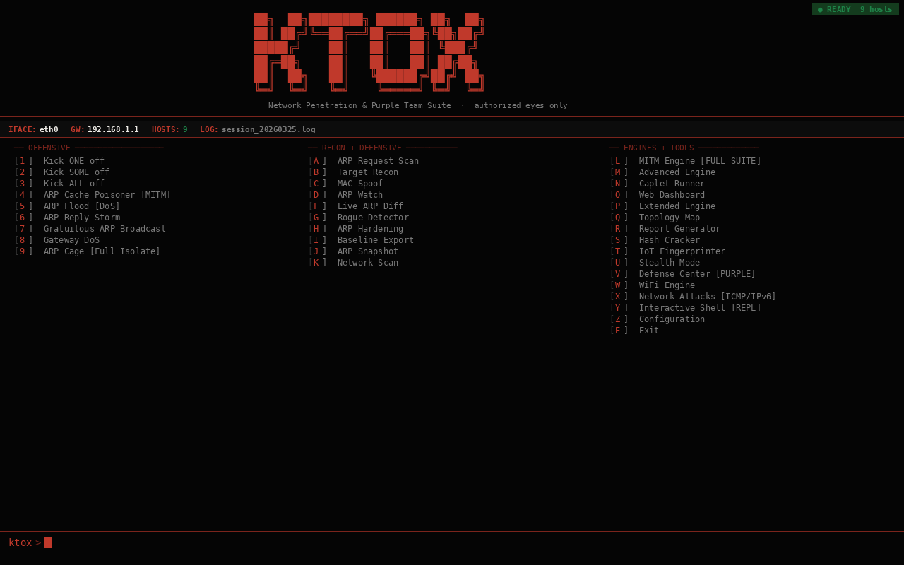
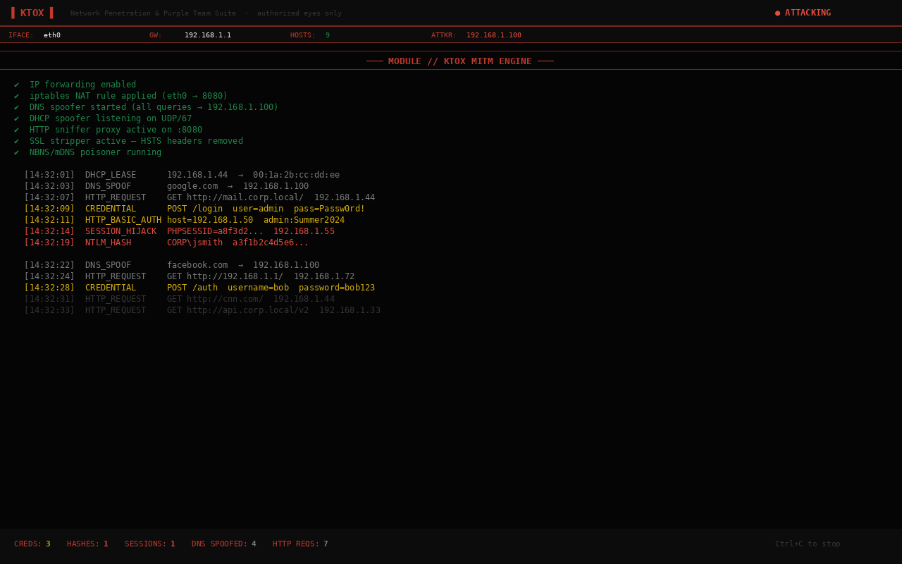
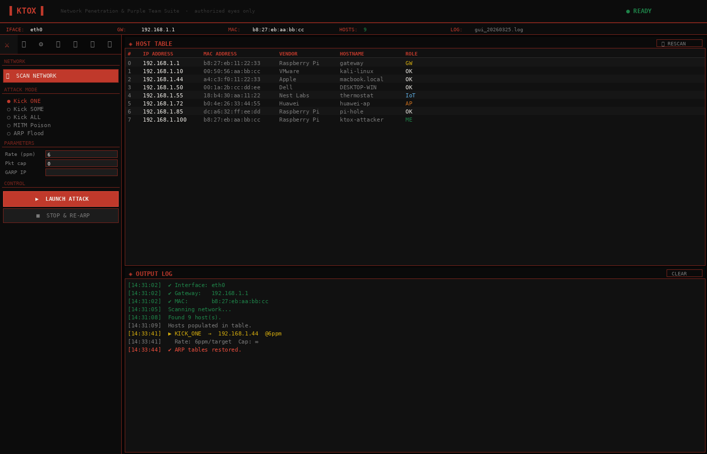
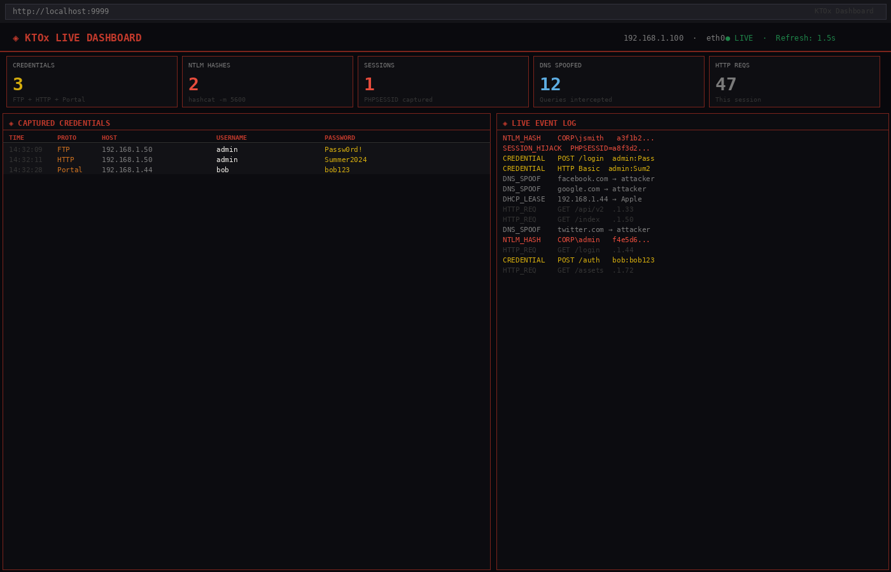
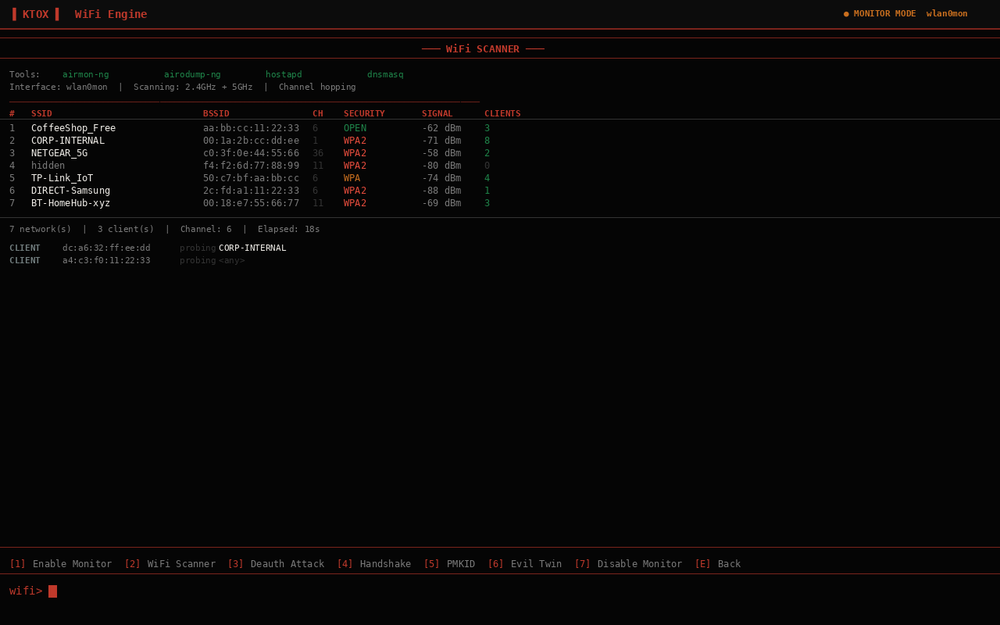

```
 ██╗  ██╗████████╗ ██████╗ ██╗  ██╗
 ██║ ██╔╝╚══██╔══╝██╔═══██╗╚██╗██╔╝
 █████╔╝    ██║   ██║   ██║ ╚███╔╝
 ██╔═██╗    ██║   ██║   ██║ ██╔██╗
 ██║  ██╗   ██║   ╚██████╔╝██╔╝ ██╗
 ╚═╝  ╚═╝   ╚═╝    ╚═════╝ ╚═╝  ╚═╝
      Network Penetration & Purple Team Suite  ·  v10.0
           authorized eyes only
```

> *"Power comes from understanding the protocol layer they forgot to secure."*

---

<div align="center">


</div>

---

## ▐ WHAT IS KTOX

**KTOx** is a complete network penetration testing and educational toolkit covering the full attack and defense spectrum. Built on ARP as a foundation, it has grown into a suite that rivals tools like bettercap, Responder, and ettercap — with features none of them offer individually:

- **50+ attack, recon, and defensive modules** across 7 engine files
- **Blood-red terminal TUI** powered by Rich
- **Cyberpunk CustomTkinter desktop GUI** — adaptive, screen-aware
- **Live web dashboard** — browser UI updating every 1.5 seconds
- **Caplet automation engine** — script attack sequences in `.ktox` files
- **IoT fingerprinter** — 5-layer device identification
- **Stealth mode** — rate limiting, jitter, MAC rotation, IDS evasion
- **Full pentest report generator** — Markdown + HTML from session loot
- **Network topology mapper** — interactive visual HTML LAN map
- **Defensive toolkit** — the only tool in this class with active defense modules

---

## ▐ RUNNING

```bash
# Terminal UI (CLI)
sudo python3 ktox.py

# Desktop GUI
sudo python3 ktox.py --gui

# If using a venv with sudo
sudo ./venv/bin/python3 ktox.py --gui
```

> **Caplets:** Run automation scripts from inside the TUI via `[N] Caplet Runner`.

---

## ▐ FILE STRUCTURE

```
KTOx/
├── ktox.py             ← Entry point + full CLI TUI (all 35+ modules)
├── ktox_gui.py         ← CustomTkinter adaptive GUI
├── ktox_mitm.py        ← MITM engine: DNS/DHCP spoof, SSL strip, captive portal
├── ktox_advanced.py    ← JS injector, multi-protocol sniffer, PCAP, NTLMv2, session hijack, caplets
├── ktox_extended.py    ← LLMNR/WPAD, rogue SMB, hash cracker, topology mapper, report generator
├── ktox_stealth.py     ← IoT fingerprinter, stealth mode engine
├── ktox_defense.py     ← Purple team defense engine (paired defenses for every attack)
├── ktox_wifi.py        ← WiFi engine (monitor, deauth, handshake, PMKID, evil twin)
├── ktox_netattack.py   ← ICMP redirect + IPv6 attacks (NDP, DHCPv6, RA flood)
├── ktox_repl.py        ← Interactive REPL shell + plugin system
├── ktox_config.py      ← Persistent configuration (~/.ktox/config.json)
├── ktox_dashboard.py   ← Live web dashboard (Flask)
├── scan.py             ← nmap network scanner — returns IP, MAC, vendor, hostname
├── spoof.py            ← scapy ARP packet engine
├── README.md           ← you are here
├── index.html          ← GitHub Pages site
└── ktox_loot/          ← created at runtime
    ├── session_TIMESTAMP.log       ← CLI session logs (NDJSON)
    ├── gui_TIMESTAMP.log           ← GUI session logs
    ├── mitm_TIMESTAMP.log          ← MITM engine logs
    ├── advanced.log                ← Advanced engine logs
    ├── extended.log                ← Extended engine logs
    ├── stealth.log                 ← Stealth/fingerprint logs
    ├── ntlm_hashes.txt             ← Captured NTLMv2 hashes (hashcat format)
    ├── session_replay.sh           ← Cookie replay curl commands
    ├── arp_harden.sh               ← Generated ARP hardening script
    ├── baseline_TIMESTAMP.json     ← Network baselines
    ├── fingerprint_TIMESTAMP.json  ← IoT fingerprint results
    ├── topology_TIMESTAMP.html     ← Interactive network map
    ├── topology_TIMESTAMP.json     ← Topology data
    ├── capture_TIMESTAMP.pcap      ← Wireshark-compatible captures
    ├── ktox_report_TIMESTAMP.html  ← Pentest report
    ├── audit_TIMESTAMP.json         ← Purple team audit results
    └── defense.log                  ← Defense actions log
```

---

## ▐ FULL MODULE LIST

### ── OFFENSIVE ──────────────────────────────────────────────────────────

```
[1]  Kick ONE off              Single-target ARP denial
[2]  Kick SOME off             Multi-target ARP denial
[3]  Kick ALL off              All non-gateway hosts
[4]  ARP Cache Poisoner [MITM] Bidirectional intercept
[5]  ARP Flood [DoS]           Saturate single target ARP cache
[6]  ARP Reply Storm           Flood entire broadcast domain
[7]  Gratuitous ARP Broadcast  Claim any IP on segment
[8]  Gateway DoS               Flood the router directly
[9]  ARP Cage [Full Isolate]   Cut target off from entire LAN
```

### ── RECON ───────────────────────────────────────────────────────────────

```
[A]  ARP Request Scan          Stealth host discovery via ARP
[B]  Target Recon              Port scan + MAC/hostname enum
[C]  MAC Spoof                 Change interface MAC for OpSec
[K]  Network Scan              Full host discovery + host table refresh
[T]  IoT Fingerprinter         5-layer device type identification
```

### ── MITM ENGINE (ktox_mitm.py) ─────────────────────────────────────────

```
[L]  MITM Engine               Full suite launcher with auto iptables
     · DNS Spoofer             Intercept + forge DNS responses (per-domain rules)
     · DHCP Spoofer            Become the DHCP server — own gateway + DNS
     · HTTP Sniffer            Capture HTTP requests, POST bodies, credentials
     · SSL Stripper            Downgrade HTTPS → HTTP, remove HSTS + Secure flags
     · NBNS/mDNS Poisoner      Windows + Apple name resolution poisoning
     · Captive Portal          5 themes: WiFi, hotel, corporate, coffee, ISP
```

### ── ADVANCED ENGINE (ktox_advanced.py) ────────────────────────────────

```
[M]  Advanced Engine           Full advanced suite launcher
     · JS/HTML Injector        8 payloads: keylogger, cred harvest, session
                               stealer, BeEF hook, redirect, camera grab
     · Multi-Protocol Sniffer  FTP · SMTP · POP3 · IMAP · Telnet · IRC
                               Redis · SNMP · HTTP Basic Auth
     · PCAP Capture            Wireshark-compatible .pcap export
     · NTLMv2 Hash Capture     HTTP + SMB NTLMSSP extraction
     · Session Hijacker        Cookie theft + curl replay script generation
[N]  Caplet Runner             Run .ktox automation scripts
```

### ── EXTENDED ENGINE (ktox_extended.py) ────────────────────────────────

```
[P]  Extended Engine           Windows attack stack + analysis tools
     · LLMNR Poisoner          UDP/5355 — Windows name resolution hijack
     · NBT-NS Poisoner         UDP/137 — NetBIOS name service poisoning
     · WPAD Rogue Proxy        Force NTLM auth on WPAD fetch — silent hash harvest
     · Rogue SMB Server        Capture NTLMv2 hashes via fake SMB on TCP/445
     · Full Windows Stack      All four above running simultaneously
[Q]  Topology Map              Visual interactive HTML LAN map
[R]  Report Generator          Full pentest report (Markdown + HTML)
[S]  Hash Cracker              hashcat/john interface for captured hashes
```

### ── WiFi ENGINE (ktox_wifi.py) ─────────────────────────────────────────

```
[W]  WiFi Engine menu
     [I]  Select Interface      Pick wlan0, wlan1, Alfa, TP-Link — persists session
     [1]  Enable Monitor Mode   airmon-ng check kill → airmon-ng start
                                Auto-detects driver (brcmfmac/Nexmon for Pi onboard)
                                Watchdog + auto-recovery if interface crashes
     [2]  WiFi Scanner          airodump-ng CSV backend — APs, clients, signal,
                                encryption, client↔AP association, live updates
     [3]  Deauth Attack         802.11 deauth frames — single client or broadcast
                                Watchdog checks interface health every 50 frames
     [4]  Handshake Capture     WPA2 4-way EAPOL — saves .cap for aircrack/hashcat
     [5]  PMKID Attack          Clientless WPA2 hash capture (no handshake needed)
     [6]  Evil Twin AP          Rogue AP with hostapd + dnsmasq + captive portal
     [7]  Disable Monitor Mode  airmon-ng stop → restart NetworkManager
```

```
[D]  ARP Watch                 Passive conflict monitor (packet sniff)
[F]  Live ARP Diff             Poll OS ARP table, alert on changes
[G]  Rogue Device Detector     Alert on new MACs joining the network
[H]  ARP Hardening             Apply static ARP entries for all hosts
[I]  Network Baseline Export   Export trusted JSON network snapshot
[J]  ARP Table Snapshot        Dump current OS ARP table to loot
```

### ── PURPLE TEAM DEFENSE (ktox_defense.py) ─────────────────────────────

```
[V]  Defense Center        Full purple team defense suite
     · ARP Hardening       Apply static ARP entries (auto — one command)
     · ARP Table Verify    Check live ARP table against known-good baseline
     · Disable LLMNR       Block LLMNR/NBT-NS via systemd-resolved + iptables
     · SMB Signing         Enforce mandatory SMB signing via smb.conf
     · TLS Enforcement     HSTS headers, HTTPS redirect, Secure cookie flags
     · Encrypted DNS       Configure DNS-over-TLS via systemd-resolved
     · Cleartext Audit     Scan for FTP/Telnet/POP3/IMAP/Redis exposure
     · LLMNR Detector      Passive monitor for active poisoning attempts
     · VLAN Guidance       Network segmentation recommendations
     · Port Security       Switch DAI + storm control configuration guide
     · Purple Team Audit   Full posture assessment → audit_TIMESTAMP.json
```

### ── WiFi ENGINE (ktox_wifi.py) ─────────────────────────────────────────

```
[W]  WiFi Engine           Full wireless attack suite
     · Monitor Mode        Enable/disable monitor mode (airmon-ng or iw fallback)
     · WiFi Scanner        Passive AP + client discovery with channel hopping
     · Deauth Attack       Force client disconnection (802.11 deauth frames)
     · Handshake Capture   WPA2 4-way handshake for offline cracking
     · PMKID Attack        Clientless WPA2 hash capture (no connected client)
     · Evil Twin AP        Rogue access point with hostapd + dnsmasq DHCP
```

### ── NETWORK ATTACKS (ktox_netattack.py) ───────────────────────────────

```
[X]  Network Attacks       ICMP + IPv6 protocol attacks
     · ICMP Redirect       Stealthy MITM via routing table (bypasses ARP monitoring)
     · IPv6 Scanner        ICMPv6 NS/RS host discovery
     · NDP Spoofer         IPv6 Neighbor Discovery poisoning (IPv6 ARP equivalent)
     · DHCPv6 Spoofer      Rogue IPv6 DHCP server — poison DNS for all IPv6 clients
     · RA Flood            Rogue Router Advertisement / random prefix flood (DoS)
```

### ── INTERACTIVE SHELL ───────────────────────────────────────────────────

```
[Y]  Interactive Shell     bettercap-style REPL console
     · set/get/env         Session variable management
     · module.start/stop   Launch and stop any KTOx module
     · module.list/status  Show available and running modules
     · hosts / scan / loot Built-in recon and loot inspection
     · exec                Run shell commands inline
     · Tab completion      Complete module names and variable names
     · Plugin system       Drop .py files into modules/ for auto-loading
```

### ── STEALTH & ANALYSIS ─────────────────────────────────────────────────

```
[U]  Stealth Mode              IDS evasion: rate limit, jitter, MAC rotation
[O]  Web Dashboard             Live browser UI at http://localhost:9999
```

---

## ▐ MODULE DETAILS

### MITM Engine — Auto iptables management
KTOx automatically enables IP forwarding and sets up iptables NAT rules when the MITM engine starts. All rules are cleanly removed on exit. Enable packet forwarding for full interception:
```bash
echo 1 > /proc/sys/net/ipv4/ip_forward
```

### DNS Spoofer
Supports per-domain rules or wildcard. Configure via interactive prompt:
```
domain:ip,domain:ip   →  google.com:1.2.3.4,facebook.com:1.2.3.4
*                     →  spoof all queries to attacker IP
```

### JS/HTML Injector — Built-in payloads
| Payload | Description |
|---------|-------------|
| `keylogger` | Captures keystrokes, reports to loot receiver port 7331 |
| `credential_intercept` | Hooks form submit events, captures all field data |
| `session_stealer` | Exfiltrates `document.cookie` + current URL |
| `beef_hook` | Injects BeEF hook.js for browser exploitation framework |
| `redirect` | Redirects victim to captive portal |
| `camera_grab` | Requests camera access, sends JPEG frame to attacker |
| `alert_test` | Tests injection with a visible alert |
| `crypto_miner` | Injects a mining script |

### LLMNR + NBT-NS + WPAD + Rogue SMB — Windows Attack Stack
The most effective attack chain for Windows/Active Directory environments:
1. LLMNR/NBT-NS broadcasts intercepted → victim redirected to attacker
2. Victim's SMB client authenticates → NTLMv2 hash captured automatically
3. WPAD fetch forces NTLM auth → additional hash capture with no user interaction
4. Hashes saved to `ktox_loot/ntlm_hashes.txt` in hashcat format

```bash
# Crack captured hashes
hashcat -m 5600 ktox_loot/ntlm_hashes.txt /usr/share/wordlists/rockyou.txt
# With rules
hashcat -m 5600 ktox_loot/ntlm_hashes.txt wordlist.txt -r /usr/share/hashcat/rules/best64.rule
```

### IoT Fingerprinter — 5-Layer Detection
| Layer | Method | Source |
|-------|--------|--------|
| 1 | MAC OUI lookup | 70+ manufacturer entries |
| 2 | Port profile matching | 30+ device port signatures |
| 3 | Service banner grabbing | 35+ regex signatures |
| 4 | HTTP path probing | 24 known embedded UI paths |
| 5 | Confidence scoring | Weighted combination of all layers |

Identifies: Raspberry Pi, ESP8266/ESP32, Nest, Philips Hue, IP cameras (Hikvision, Dahua, Axis), NAS (Synology, QNAP), routers, printers, Plex servers, Home Assistant, Node-RED, industrial PLCs (Modbus/S7), medical devices, and more.

### Stealth Mode — IDS Evasion Profiles
| Profile | Rate Cap | Jitter | MAC Rotation | Idle Injection |
|---------|----------|--------|--------------|----------------|
| Ghost | 6 ppm | 3–12s | Every 5 min | ✔ |
| Ninja | 30 ppm | 0.5–3s | Every 10 min | ✖ |
| Normal | 120 ppm | 50–300ms | Disabled | ✖ |
| Custom | User-set | User-set | User-set | Optional |

MAC rotation uses locally-administered addresses (02:xx:xx:xx:xx:xx). Original MAC restored automatically on stop.

### Caplet Automation Engine
Write attack sequences in `.ktox` files:
```
# Example caplet
set IFACE       wlan0
set ATTACKER_IP 192.168.1.100

mitm.start
js.inject credential_intercept
proto.sniff
ntlm.capture
session.hijack
pcap.start
wait 300
stop
```

Commands: `set`, `mitm.start`, `js.inject`, `proto.sniff`, `ntlm.capture`, `session.hijack`, `pcap.start`, `wait`, `echo`, `shell`, `stop`

Generate an example: select `[N] Caplet Runner` → type `example`

### Web Dashboard
Launch with module `[O]` — access at `http://localhost:9999` or `http://ATTACKER_IP:9999` from any browser on the network.

Live panels (1.5s refresh):
- Credentials captured
- Session hijacks + cookie data
- NTLMv2 hashes
- DNS query log
- HTTP traffic
- Rolling event log with colour coding

### Report Generator
Reads all NDJSON loot files and produces:
- **Markdown** — clean text report for inclusion in pentest documentation
- **HTML** — styled printable report with credential tables, hash tables, recommendations

---

## ▐ SESSION LOGGING

All events written as newline-delimited JSON:

```json
{"ts":"2026-03-20T14:32:01","event":"SCAN_COMPLETE","data":{"count":9}}
{"ts":"2026-03-20T14:33:10","event":"MITM_START","data":{"target":"192.168.1.42"}}
{"ts":"2026-03-20T14:35:44","event":"LLMNR_POISONED","data":{"name":"fileserver","redirected_to":"192.168.1.100"}}
{"ts":"2026-03-20T14:36:01","event":"SMB_NTLM_HASH","data":{"domain":"CORP","username":"jdoe","nt_hash":"..."}}
{"ts":"2026-03-20T14:37:20","event":"SESSION_HIJACK","data":{"host":"app.example.com","cookie":"PHPSESSID=..."}}
{"ts":"2026-03-20T14:40:01","event":"ROGUE_DETECTED","data":{"ip":"192.168.1.99","mac":"de:ad:be:ef:00:01"}}
```

Parse with `jq`:
```bash
jq 'select(.event == "SMB_NTLM_HASH")'     ktox_loot/*.log
jq 'select(.event == "SESSION_HIJACK")'     ktox_loot/*.log
jq 'select(.event == "LLMNR_POISONED")'     ktox_loot/*.log
jq 'select(.event == "ROGUE_DETECTED")'     ktox_loot/*.log
jq 'select(.event | startswith("CRED"))'    ktox_loot/*.log
```

---

## ▐ SCREENSHOTS

| TUI Main Menu | MITM Engine | Desktop GUI |
|:---:|:---:|:---:|
|  |  |  |

| Web Dashboard | WiFi Engine |
|:---:|:---:|
|  |  |

---

## ▐ RASPBERRY PI 5 — WIFI MONITOR MODE

KTOx uses the same monitor mode method as wifite — `airmon-ng check kill` then `airmon-ng start`. For the Pi 5 onboard WiFi (brcmfmac/Nexmon), install the Kali Nexmon packages first:

```bash
sudo apt update && sudo apt full-upgrade -y
sudo apt install -y brcmfmac-nexmon-dkms firmware-nexmon
sudo reboot
```

After reboot, enable monitor mode from `[W] WiFi Engine` → `[1] Enable Monitor Mode`. KTOx detects the driver automatically, runs `airmon-ng check kill`, starts monitor mode, then confirms `wlan0mon` exists in `iw dev` before reporting success. If the interface crashes mid-session, the built-in watchdog recovers it automatically.

External USB adapters (Alfa AWUS036ACH, TP-Link TL-WN722N, etc.) work out of the box — select them with `[I] Select Interface` in the WiFi menu.

---

## ▐ REQUIREMENTS

### Python dependencies

```bash
pip3 install -r requirements.txt
```

Or manually:

```bash
pip3 install rich scapy python-nmap netifaces customtkinter flask
```

> **Kali / Debian with system Python (no venv):**
> ```bash
> sudo pip3 install -r requirements.txt --break-system-packages
> ```

| Package | Purpose |
|---------|---------|
| `rich` | Terminal TUI — colours, tables, panels, spinners |
| `scapy` | Packet crafting — ARP, 802.11, ICMP, EAPOL frames |
| `python-nmap` | Network scanning (wraps nmap) |
| `netifaces` | Interface and gateway enumeration |
| `customtkinter` | Desktop GUI |
| `flask` | Live web dashboard at localhost:9999 |

### System dependencies

```bash
# Kali / Debian / Ubuntu — install everything at once
sudo apt install -y nmap aircrack-ng hostapd dnsmasq hashcat john ethtool net-tools

# Raspberry Pi 5 — onboard WiFi monitor mode (Kali 2025.1+)
sudo apt install -y brcmfmac-nexmon-dkms firmware-nexmon && sudo reboot

# Arch
sudo pacman -S nmap aircrack-ng hostapd dnsmasq hashcat

# macOS (limited — WiFi modules require Linux)
brew install nmap libdnet
```

| Tool | Purpose | Required |
|------|---------|----------|
| `nmap` | Host discovery and port scanning | ✔ Core |
| `aircrack-ng` suite | `airmon-ng`, `airodump-ng`, `aireplay-ng` for WiFi engine | WiFi only |
| `hostapd` | Evil Twin AP | WiFi only |
| `dnsmasq` | Evil Twin DHCP/DNS | WiFi only |
| `hashcat` | WPA/NTLMv2 hash cracking | Optional |
| `john` | Alternative hash cracker | Optional |
| `ethtool` | Driver detection for monitor mode | Recommended |
| `net-tools` | `arp` command for ARP table ops | Recommended |

---

## ▐ INSTALL & RUN

```bash
git clone https://github.com/wickednull/KTOx
cd KTOx

# Install Python dependencies
sudo pip3 install -r requirements.txt --break-system-packages

# Install system tools (Kali/Debian)
sudo apt install -y nmap aircrack-ng hostapd dnsmasq hashcat ethtool net-tools

# CLI
sudo python3 ktox.py

# GUI
sudo python3 ktox.py --gui

# Venv (optional — use if you don't want --break-system-packages)
python3 -m venv venv
source venv/bin/activate
pip install -r requirements.txt
sudo ./venv/bin/python3 ktox.py
```

---

## ▐ DEFENSE MATRIX

KTOx `[V]` Defense Center applies or guides each of these automatically.

| Defense | DoS | MITM | Flood | Storm | LLMNR | WPAD | SMB Relay | DNS Spoof | SSL Strip |
|---------|-----|------|-------|-------|-------|------|-----------|-----------|-----------|
| Static ARP `[H]` / `[V]` | ✔ | ✔ | ✖ | ✖ | ✖ | ✖ | ✖ | ✖ | ✖ |
| ARP Verify `[V]` | 🔍 | 🔍 | 🔍 | 🔍 | ✖ | ✖ | ✖ | ✖ | ✖ |
| Disable LLMNR `[V]` | ✖ | ✖ | ✖ | ✖ | ✔ | ✔ | ✔ | ✖ | ✖ |
| SMB Signing `[V]` | ✖ | ✖ | ✖ | ✖ | ✖ | ✖ | ✔ | ✖ | ✖ |
| Encrypted DNS `[V]` | ✖ | ✖ | ✖ | ✖ | ✖ | ✖ | ✖ | ✔ | ✖ |
| TLS / HSTS `[V]` | ✖ | ✔ data | ✖ | ✖ | ✖ | ✖ | ✖ | ✖ | ✔ |
| Dynamic ARP Inspection | ✔ | ✔ | ✔ | ✔ | ✖ | ✖ | ✖ | ✖ | ✖ |
| VLAN Segmentation | ✔ | ✔ | ✔ | ✔ | ✔ | ✔ | ✔ | ✔ | ✔ |
| ARP Watch `[D]` | 🔍 | 🔍 | 🔍 | 🔍 | ✖ | ✖ | ✖ | ✖ | ✖ |
| LLMNR Detector `[V]` | ✖ | ✖ | ✖ | ✖ | 🔍 | 🔍 | ✖ | ✖ | ✖ |

✔ Prevents · 🔍 Detects · ✖ Does not apply

---

## ▐ COMPATIBILITY

| Platform | CLI | GUI | Notes |
|----------|-----|-----|-------|
| Kali Linux | ✔ | ✔ | Primary platform |
| Debian / Ubuntu | ✔ | ✔ | Full support |
| Arch Linux | ✔ | ✔ | Full support |
| Raspberry Pi 5 (Kali ARM) | ✔ | ✔ | Requires Nexmon for onboard WiFi monitor mode |
| macOS | ✔ | ✔ | Requires libdnet + brew nmap |
| Windows | ✖ | ✖ | Not supported |

Python **3.8+** required. Must be run as **root**.

---

## ▐ DISCLAIMER

KTOx is an **educational tool** for **authorized security testing only** — on networks and devices you own or have explicit written permission to test. Unauthorized use is illegal under the Computer Fraud and Abuse Act, Computer Misuse Act, and equivalent legislation worldwide.

**The author accepts no liability for misuse.**

---

## ▐ CREDITS

ARP engine based on [KickThemOut](https://github.com/k4m4/kickthemout) by
[Nikolaos Kamarinakis](https://github.com/k4m4) & [David Schütz](https://github.com/xdavidhu)

Extended and rebuilt by **[wickednull](https://github.com/wickednull)**

---

<div align="center">

```
▐████████████████████████████████████████████████████████████████▌
  KTOx v10.0  ·  Network Penetration & Purple Team Suite  ·  github/wickednull
▐████████████████████████████████████████████████████████████████▌
```


</div>
